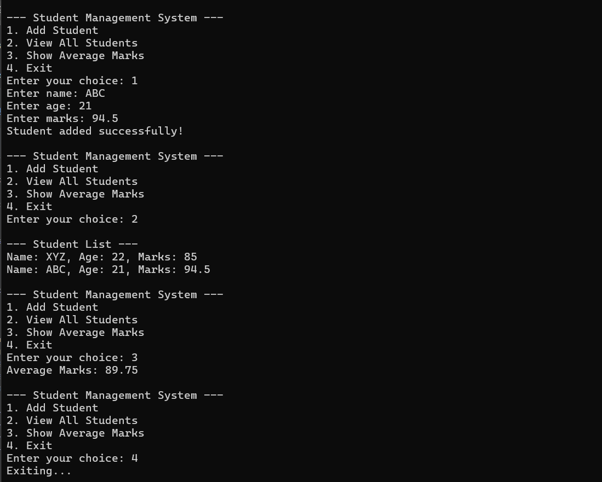

# Student Management System

A simple console-based Student Management System built with C# in Visual Studio to handle student records efficiently.

## Features

- **Add Student**: Register new students with name, age, and academic marks
- **View All Students**: Display a list of all registered students and their details
- **Show Average Marks**: Calculate and display the average marks of all registered students
- **Data Persistence**: Student records are maintained during program execution

## Getting Started

### Prerequisites

- Microsoft Visual Studio (2019 or newer recommended)
- .NET Framework or .NET Core/.NET 5+
- Basic knowledge of C# and console applications

### Installation

1. Clone the repository
   ```
   git clone https://github.com/barmansagarika/Student-Management.git
   ```

2. Navigate to the project directory
   ```
   cd Student-Management
   ```

3. Open the solution file (.sln) with Visual Studio

4. Build the solution by pressing F6 or using Build > Build Solution

5. Run the application by pressing F5 or using Debug > Start Debugging

## Usage

1. From the main menu, select an option by entering the corresponding number:
   - Enter `1` to add a new student
   - Enter `2` to view all registered students
   - Enter `3` to calculate and display average marks
   - Enter `4` to exit the program

2. When adding a student:
   - Enter the student's name
   - Enter the student's age (numeric value)
   - Enter the student's marks (numeric value, can be decimal)

## Screenshots



## Contact

Sagarika Barman - [@barmansagarika](https://github.com/barmansagarika)

Project Link: [https://github.com/barmansagarika/Student-Management](https://github.com/barmansagarika/Student-Management)

## Acknowledgements

- This project was created as a learning exercise for C# programming.
